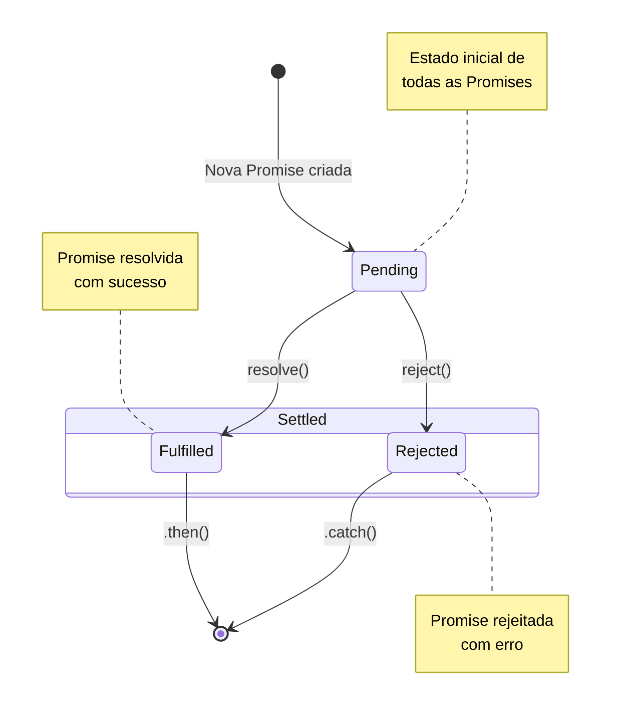

# Programação assíncrona em JavaScript: Promises, async/await

## Sumário
- [Introdução](#introdução)
- [Callbacks (Forma tradicional)](#callbacks-forma-tradicional)
- [Problemas com Callbacks](#problemas-com-callbacks)
- [Promises](#promises)
- [Async/Await](#asyncawait)
- [Exemplos práticos](#exemplos-práticos)
- [Boas práticas](#boas-práticas)
- [Exercícios Propostos](#exercícios-propostos)
- [Recursos adicionais](#recursos-adicionais)

## Introdução

Programação assíncrona é um conceito fundamental em JavaScript que permite que operações demoradas sejam executadas sem bloquear o resto do código. Isso é especialmente importante em aplicações web, onde precisamos lidar com operações como:
- Requisições HTTP
- Leitura/escrita de arquivos
- Operações em banco de dados
- Temporizadores

## Callbacks (Forma tradicional)

Tradicionalmente, JavaScript utilizava callbacks para lidar com operações assíncronas:

```javascript
function buscarDados(callback) {
  setTimeout(() => {
    const dados = { id: 1, nome: 'João' };
    callback(dados);
  }, 2000);
}

buscarDados((dados) => {
  console.log(dados); // Executado após 2 segundos
});
```

### Problemas com Callbacks
- Callback Hell (aninhamento excessivo)
- Dificuldade no tratamento de erros
- Código menos legível e maintível

## Promises

Promises são objetos que representam a eventual conclusão (ou falha) de uma operação assíncrona.

### Estados de uma Promise
- `Pending`: Estado inicial
- `Fulfilled`: Operação concluída com sucesso
- `Rejected`: Operação falhou
- `Settled`: Estado final, após a Promise ser resolvida ou rejeitada

```javascript
const minhaPromise = new Promise((resolve, reject) => {
  setTimeout(() => {
    const sucesso = false;
    if (sucesso) {
      resolve('Operação concluída!');
    } else {
      reject('Erro na operação');
    }
  }, 2000);
});

minhaPromise
  .then(resultado => console.log(resultado))
  .catch(erro => console.error(erro));
```



### Métodos de Promise
- `then()`: Executa quando a Promise é resolvida
- `catch()`: Executa quando a Promise é rejeitada
- `finally()`: Executa independentemente do resultado

## Async/Await

`Async/Await` é uma sintaxe moderna para lidar com operações assíncronas de forma mais legível e fácil de entender.

```javascript
async function buscarUsuario() {
  try {
    const response = await fetch('https://api.exemplo.com/usuario');
    const dados = await response.json();

    return dados;
  } catch (erro) {
    console.error('Erro:', erro);
  }
}
```

### Vantagens do async/await
- Código mais limpo e legível
- Melhor tratamento de erros com try/catch
- Comportamento mais próximo do síncrono
- Facilita o debug

## Exemplos práticos

### Encadeamento de Promises

```javascript
function buscarUsuario(id) {
  return fetch(`https://api.exemplo.com/usuario/${id}`)
    .then(response => response.json());
}

function buscarPedidos(usuario) {
  return fetch(`https://api.exemplo.com/pedidos/${usuario.id}`)
    .then(response => response.json());
}

// Com Promises
buscarUsuario(1)
  .then(usuario => buscarPedidos(usuario))
  .then(pedidos => console.log(pedidos))
  .catch(erro => console.error(erro));

// Com async/await
async function buscarDadosCompletos() {
  try {
    const usuario = await buscarUsuario(1);
    const pedidos = await buscarPedidos(usuario);

    console.log(pedidos);
  } catch (erro) {
    console.error(erro);
  }
}
```

## Boas práticas

1. Sempre trate erros adequadamente
2. Evite misturar callbacks com promises
3. Prefira async/await para código mais legível
4. Use [Promise.all()](https://developer.mozilla.org/en-US/docs/Web/JavaScript/Reference/Global_Objects/Promise/all) quando possível para operações paralelas
5. Use [Promise.race()](https://developer.mozilla.org/en-US/docs/Web/JavaScript/Reference/Global_Objects/Promise/race) para operações paralelas com timeout. O resultado será a primeira Promise a ser resolvida ou rejeitada.
6. Mantenha o código assíncrono modular e reutilizável

## Exercícios resolvidos

1. [Criando uma Promise para validar um número](./src/exemplo01.js)
2. [Encadeamento de Promises com Promise.all()](./src/exemplo02.js)
3. [Consumindo uma API com async/await e fetch](./src/exemplo03.js)
4. [Promises paralelas com Promise.race()](./src/exemplo04.js)

## Exercícios Propostos

### 1. Timer Múltiplo
**Objetivo**: Trabalhar com múltiplos timers simultâneos.

**Instruções**:
1. Crie uma função que aceita um array de tempos em millisegundos
2. Utilize Promise.all() para gerenciar múltiplos timers
3. A função deve retornar apenas quando todos os timers terminarem
4. Inclua mensagens indicando o início e fim de cada timer

### 2. Validador de Cadastro
**Objetivo**: Criar um sistema de validação de dados de usuário.

**Instruções**:
1. Valide um objeto com: nome, idade e email
2. Implemente as seguintes regras:
   - Nome: mínimo 3 caracteres
   - Idade: número positivo
   - Email: deve conter @ e .
3. Use async/await
4. Retorne mensagens de erro específicas para cada validação

### 3. Verificador de Email
**Objetivo**: Praticar encadeamento de Promises e validações sequenciais.

**Instruções**:
1. Crie duas funções de validação:
   - Uma para verificar o formato do email (deve conter @)
   - Outra para verificar o domínio (deve terminar em .com)
2. Cada função deve retornar uma Promise
3. Implemente a validação de duas formas:
   - Usando .then() encadeado
   - Usando async/await
4. Teste com emails válidos e inválidos

### 4. Processamento em Lote
**Objetivo**: Trabalhar com múltiplas Promises em paralelo.

**Instruções**:
1. Crie uma função que recebe um array de CEPs
2. A função deve:
   - Buscar todos os CEPs simultaneamente
   - Utilizar Promise.all()
   - Tratar erros adequadamente (ex.: CEP inválido ou Endereço não encontrado)
3. Retornar um array com todos os endereços encontrados
4. Testar com diferentes combinações de CEPs

## Recursos adicionais

- [MDN Web Docs - Promises](https://developer.mozilla.org/pt-BR/docs/Web/JavaScript/Reference/Global_Objects/Promise)
- [MDN Web Docs - async function](https://developer.mozilla.org/pt-BR/docs/Web/JavaScript/Reference/Statements/async_function)
- [JavaScript.info - Promises](https://javascript.info/promise-basics)