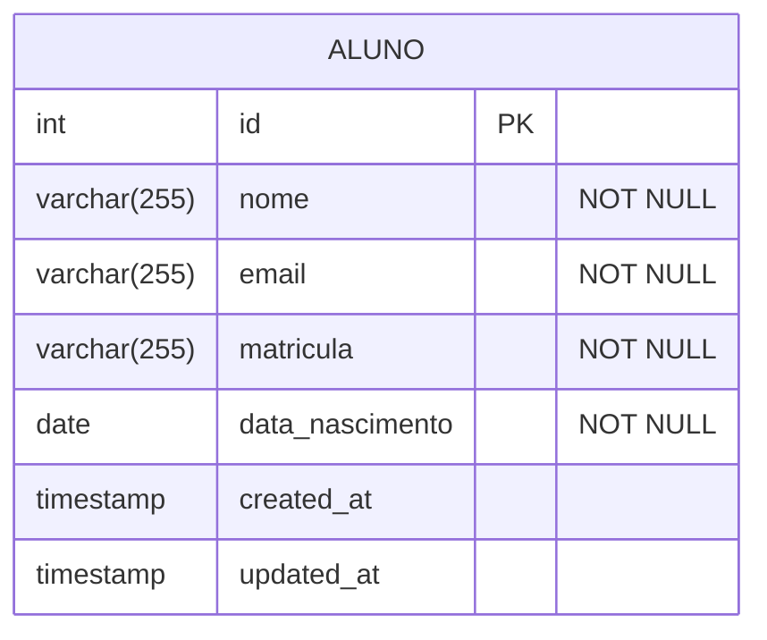

# Configuração e uso da biblioteca `pg` com Node.js

## Sumário

- [Dependências](#dependências)
- [Configuração](#configuração)
- [Operações com o banco de dados](#operações-com-o-banco-de-dados)
- [Projeto de exemplo](#projeto-de-exemplo)
  - [Executando o projeto](#executando-o-projeto)
  - [Banco de dados (aluno.sql)](#banco-de-dados-alunosql)
  - [Variáveis de ambiente (.env)](#variáveis-de-ambiente-env)
  - [Conexão com o banco de dados (db.js)](#conexão-com-o-banco-de-dados-dbjs)
  - [Modelo de dados (alunoModel.js)](#modelo-de-dados-alunomodeljs)
  - [Arquivo principal (index.js)](#arquivo-principal-indexjs)
- [Utilizando a extensão Database Client](#utilizando-a-extensão-database-client)
  - [Instalação](#instalação)
  - [Demonstração da extensão](#demonstração-da-extensão)
- [Exercícios](#exercícios)
- [Referências](#referências)

## Dependências

Utilizaremos a biblioteca `pg` para acessar o banco de dados PostgreSQL. Para instalar, execute o seguinte comando:

```bash
npm install pg
```

## Configuração

A conexão com o banco de dados é feita utilizando a classe `Pool` da biblioteca `pg`. O Pool é uma ferramenta essencial que gerencia um conjunto de conexões reutilizáveis com o banco de dados, oferecendo várias vantagens:

- Melhor performance ao reutilizar conexões existentes
- Gerenciamento automático do número de conexões
- Tratamento de falhas e reconexões
- Evita vazamentos de memória

### Estrutura do arquivo db.js

Exemplo de uso com Pool:

```js
const { Pool } = require('pg');

const dbConfig = {
  host: process.env.DB_HOST,
  port: process.env.DB_PORT,
  user: process.env.DB_USER,
  password: process.env.DB_PASSWORD,
  database: process.env.DB_NAME,
};

const pool = new Pool(dbConfig);

// Função auxiliar para executar queries
const query = async (text, params) => {
  const result = await pool.query(text, params);
  return result;
};

// Função para encerrar a conexão com o banco
const closeConnection = async () => {
  await pool.end();
};
```

### Uso do Pool

O arquivo exporta duas funções principais:

1. `query(text, params)`: Executa uma query SQL e retorna o resultado
   - `text`: String contendo a query SQL
   - `params`: Array opcional com os parâmetros da query
   - Retorna um objeto com os resultados da query

2. `closeConnection()`: Fecha todas as conexões do pool
   - Deve ser chamada ao finalizar o uso do banco
   - Importante para evitar que a aplicação fique presa

## Operações com o banco de dados

As operações são realizadas através da função `query`. Exemplos de uso:

```js
// Consulta simples
const result = await query('SELECT * FROM aluno');
console.log(result.rows); // Lista todos os alunos

// Consulta com parâmetros
const id = 1;
const result = await query('SELECT * FROM aluno WHERE id = $1', [id]);
console.log(result.rows[0]); // Mostra um aluno específico

// Inserção com parâmetros
const novoAluno = ['João', 'joao@email.com', '12345', '2000-01-01'];
const result = await query(
  'INSERT INTO aluno (nome, email, matricula, data_nascimento) VALUES ($1, $2, $3, $4) RETURNING *',
  novoAluno
);
```

### Boas Práticas

1. Sempre use parâmetros (`$1`, `$2`, etc.) em vez de concatenar strings
2. Utilize `try/catch` para tratamento de erros
3. Chame `closeConnection()` ao finalizar o uso do banco
4. Use variáveis de ambiente para configurações sensíveis

O arquivo [alunoModel.js](./src/alunoModel.js) implementa estas práticas, fornecendo uma interface segura e organizada para operações Create Read Update Delete (CRUD) na tabela de alunos.

## Projeto de exemplo

Esse projeto tem quatro arquivos principais:

- [aluno.sql](./sql/aluno.sql): Define a estrutura da tabela e dados iniciais
- [.env](./.env): Arquivo que contém as variáveis de ambiente referentes a conexão com o banco de dados
- [db.js](./src/db.js): Responsável pela conexão com o banco de dados
- [alunoModel.js](./src/alunoModel.js): Contém as funções para trabalhar com dados dos alunos
- [index.js](./src/index.js): Arquivo principal que inicia nossa aplicação

### Executando o projeto

1. Crie um banco de dados chamado `escola`
2. Execute o arquivo `aluno.sql` para criar a tabela e inserir os dados iniciais
3. Execute o comando:

```bash
npm run start
``` 

### Banco de dados (aluno.sql)

O arquivo `aluno.sql` define a estrutura da tabela e dados iniciais. A tabela `aluno` possui os seguintes atributos:



### Variáveis de ambiente (.env)

O arquivo `.env` contém as variáveis de ambiente referentes a conexão com o banco de dados. As variáveis são:

- `DB_HOST`: O host do banco de dados
- `DB_PORT`: A porta do banco de dados
- `DB_USER`: O usuário do banco de dados
- `DB_PASSWORD`: A senha do usuário
- `DB_DATABASE`: O nome do banco de dados

### Conexão com o banco de dados (db.js)

O arquivo `db.js` é responsável pela conexão com o banco de dados. Ele utiliza a biblioteca `pg` para se conectar ao banco de dados e retorna uma instância do cliente `pg`.

### Modelo de dados (alunoModel.js)

O arquivo `alunoModel.js` é responsável pela manipulação dos dados da tabela `aluno`. Ele contém as funções para criar, ler, atualizar e deletar dados da tabela `aluno`.

### Arquivo principal (index.js)

O arquivo `index.js` é o arquivo principal que inicia nossa aplicação. Ele importa o modelo de dados e a conexão com o banco de dados e utiliza as funções do modelo de dados para manipular os dados da tabela `aluno`.

## Utilizando a extensão Database Client

A extensão Database Client é uma ferramenta poderosa que permite gerenciar seu banco de dados PostgreSQL diretamente no VS Code.

### Instalação

1. Abra o VS Code
2. Vá para a aba de extensões (Ctrl+Shift+X)
3. Pesquise por "Database Client"
4. Clique em "Instalar"

Ou você pode instalar a extensão através do link: [Database Client](https://marketplace.visualstudio.com/items?itemName=cweijan.vscode-database-client2)

### Demonstração da extensão

O vídeo a seguir mostra como utilizar a extensão Database Client para gerenciar seu banco de dados PostgreSQL:

[](https://www.youtube.com/watch?v=bOG6rnNoWX4)

## Exercícios

### Exercício 1 - CRUD de cursos

1. Crie um arquivo chamado `curso.sql` que define a estrutura da tabela `curso` com os seguintes atributos:
   - `id` (chave primária)
   - `nome` (varchar, não nulo)
   - `descricao` (text)

2. Acrescente os dados iniciais na tabela `curso` conforme o arquivo `curso.sql`. Utilize comandos de `INSERT` para isso.

3. Crie um arquivo chamado `cursoModel.js` que contém as funções para criar, ler, atualizar e deletar dados da tabela `curso`.

4. Modifique o arquivo `index.js` para implementar um programa que permite ao usuário cadastrar, listar, atualizar e deletar cursos. Utilize a bibliteca `prompt-sync` para capturar as entradas do usuário. Instale a extensão a partir do comando:

  ```bash
  npm install prompt-sync
  ```

## Referências
- [PostgreSQL](https://www.postgresql.org/)
- [pg](https://node-postgres.com/)
- [Extensão Database Client](https://marketplace.visualstudio.com/items?itemName=cweijan.vscode-database-client2)
