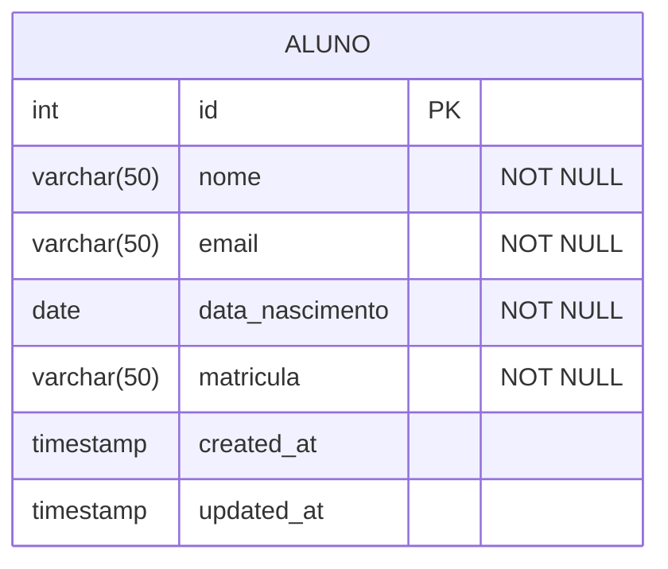

# Configuração e uso da biblioteca `pg` com Node.js

## Sumário

- [Instalação](#instalação)
- [Configuração](#configuração)
- [Operações com o banco de dados](#operações-com-o-banco-de-dados)
- [Projeto de exemplo](#projeto-de-exemplo)
  - [Executando o projeto](#executando-o-projeto)
  - [Banco de dados (aluno.sql)](#banco-de-dados-alunosql)
  - [Variáveis de ambiente (.env)](#variáveis-de-ambiente-env)
  - [Conexão com o banco de dados (db.js)](#conexão-com-o-banco-de-dados-dbjs)
  - [Modelo de dados (alunoModel.js)](#modelo-de-dados-alunomodeljs)
  - [Arquivo principal (index.js)](#arquivo-principal-indexjs)
- [Exercícios](#exercícios)
- [Referências](#referências)

## Instalação

Utilizaremos a biblioteca `pg` para acessar o banco de dados PostgreSQL. Para instalar, execute o seguinte comando:

```bash
npm install pg
```

## Configuração

A conexão com o banco de dados é feita a partir da classe `Client` da biblioteca `pg`. Os métodos `connect` e `end` são responsáveis por iniciar e encerrar a conexão com o banco de dados.

O construtor da classe `Client` recebe um objeto com as configurações de conexão com o banco de dados. Os parametros essenciais são:

- `host`: O host do banco de dados
- `port`: A porta do banco de dados
- `user`: O usuário do banco de dados
- `password`: A senha do usuário
- `database`: O nome do banco de dados

Exemplo de uso:

```js
const { Client } = require('pg');

const db = new Client({
  host: 'localhost',
  port: 5432,
  user: 'postgres',
  password: 'postgres',
  database: 'postgres'
});

db.connect();

// ...

db.end();
```

## Operações com o banco de dados

As operações de leitura e escrita no banco de dados são feitas por meio do método `query`. Este método recebe uma string com a query SQL e retorna uma Promise com o resultado da query. O atributo `rows` da resposta contém a relação de registros retornados pela query.

Exemplo de uso:

```js
const result = await db.query('SELECT * FROM aluno');
console.log(result.rows);
```

O arquivo [alunoModel.js](./src/alunoModel.js) contém exemplos de uso do método `query` para as operações de leitura e escrita no banco de dados.

## Projeto de exemplo

Esse projeto tem quatro arquivos principais:

- [aluno.sql](./sql/aluno.sql): Define a estrutura da tabela e dados iniciais
- [.env](./.env): Arquivo que contém as variáveis de ambiente referentes a conexão com o banco de dados
- [db.js](./src/db.js): Responsável pela conexão com o banco de dados
- [alunoModel.js](./src/alunoModel.js): Contém as funções para trabalhar com dados dos alunos
- [index.js](./src/index.js): Arquivo principal que inicia nossa aplicação

### Executando o projeto

1. Crie um banco de dados chamado `escola`
2. Execute o arquivo `aluno.sql` para criar a tabela e inserir os dados iniciais
3. Execute o comando:

```bash
npm run start
``` 

### Banco de dados (aluno.sql)

O arquivo `aluno.sql` define a estrutura da tabela e dados iniciais. A tabela `aluno` possui os seguintes atributos:



### Variáveis de ambiente (.env)

O arquivo `.env` contém as variáveis de ambiente referentes a conexão com o banco de dados. As variáveis são:

- `DB_HOST`: O host do banco de dados
- `DB_PORT`: A porta do banco de dados
- `DB_USER`: O usuário do banco de dados
- `DB_PASSWORD`: A senha do usuário
- `DB_DATABASE`: O nome do banco de dados

### Conexão com o banco de dados (db.js)

O arquivo `db.js` é responsável pela conexão com o banco de dados. Ele utiliza a biblioteca `pg` para se conectar ao banco de dados e retorna uma instância do cliente `pg`.

### Modelo de dados (alunoModel.js)

O arquivo `alunoModel.js` é responsável pela manipulação dos dados da tabela `aluno`. Ele contém as funções para criar, ler, atualizar e deletar dados da tabela `aluno`.

### Arquivo principal (index.js)

O arquivo `index.js` é o arquivo principal que inicia nossa aplicação. Ele importa o modelo de dados e a conexão com o banco de dados e utiliza as funções do modelo de dados para manipular os dados da tabela `aluno`.

## Exercícios

1. Crie um arquivo chamado `curso.sql` que define a estrutura da tabela `curso` com os seguintes atributos:
   - `id` (chave primária)
   - `nome` (varchar, não nulo)
   - `descricao` (text)

2. Acrescente os dados iniciais na tabela `curso` conforme o arquivo `curso.sql`. Utilize comandos de `INSERT` para isso.

3. Crie um arquivo chamado `cursoModel.js` que contém as funções para criar, ler, atualizar e deletar dados da tabela `curso`.

4. Modifique o arquivo `index.js` para implementar um programa que permite ao usuário cadastrar, listar, atualizar e deletar cursos. Utilize a bibliteca `prompt-sync` para capturar as entradas do usuário.

## Referências
- [PostgreSQL](https://www.postgresql.org/)
- [pg](https://node-postgres.com/)
