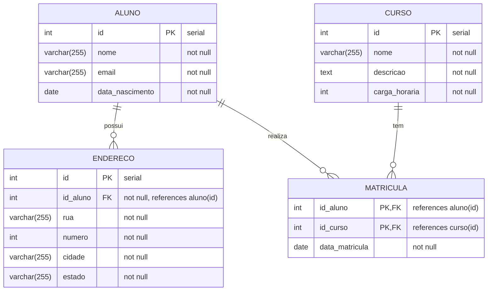

# Manipulação de dados com Node.js, Knex.js e PostgreSQL

Material didático para quem está começando a ligar uma aplicação **Node.js** a um banco **PostgreSQL**. O foco é entender **conexão**, **modelos** que encapsulam o acesso aos dados e operações **CRUD** (Create, Read, Update, Delete) usando o **Knex.js** como *query builder* — ou seja, montar consultas em JavaScript com métodos encadeados, sem escrever SQL na mão em todo o código.

## Pré-requisitos

- [Node.js](https://nodejs.org/) (versão com suporte a `node --env-file`, usada no script `npm run start`)
- [PostgreSQL](https://www.postgresql.org/) instalado e em execução
- Noções básicas de JavaScript (`async`/`await`, módulos `require`/`exports`)

## O que é o Knex.js?

[Knex.js](https://knexjs.org/) é um *query builder* para Node.js: você descreve consultas com uma API em JavaScript (`.select()`, `.where()`, `.insert()`, etc.). O Knex gera SQL parametrizado para o banco configurado, o que ajuda na **organização do código** e reduz risco de **SQL injection** quando os valores vêm de variáveis (use sempre os métodos do builder em vez de concatenar strings SQL com dados do usuário).

**Resumo do que o Knex oferece:**

- Sintaxe encadeada e legível para consultas
- Suporte a vários bancos (PostgreSQL, MySQL, SQLite, entre outros)
- Migrações e seeds (evolução controlada do esquema — não usados neste projeto mínimo, mas importantes em projetos reais)
- *Pool* de conexões configurável (`min` / `max` em `src/db/index.js`)

## Modelo de dados (escola)

O exemplo modela uma escola com relacionamentos típicos:

| Tabela      | Papel |
|------------|--------|
| **aluno**  | Cadastro de alunos |
| **endereco** | Endereços por aluno (**1:N** — um aluno, vários endereços) |
| **curso**  | Cursos ofertados |
| **matricula** | Associação aluno ↔ curso (**N:N**), com data da matrícula |

A tabela `matricula` usa **chave primária composta** (`id_aluno`, `id_curso`): um par aluno/curso não se repete.


```mermaid
erDiagram
    ALUNO ||--o{ ENDERECO : possui
    ALUNO ||--o{ MATRICULA : realiza
    CURSO ||--o{ MATRICULA : tem

    ALUNO {
        int id PK "serial"
        varchar(255) nome "not null"
        varchar(255) email "not null"
        date data_nascimento "not null"
    }

    ENDERECO {
        int id PK "serial"
        int id_aluno FK "not null, references aluno(id)"
        varchar(255) rua "not null"
        int numero "not null"
        varchar(255) cidade "not null"
        varchar(255) estado "not null"
    }

    CURSO {
        int id PK "serial"
        varchar(255) nome "not null"
        text descricao "not null"
        int carga_horaria "not null"
    }

    MATRICULA {
        int id_aluno PK,FK "references aluno(id)"
        int id_curso PK,FK "references curso(id)"
        date data_matricula "not null"
    }
```

## Como executar o projeto

1. Clone o repositório (ou use esta pasta dentro do monorepositório).
2. Instale as dependências: `npm install`
3. Crie um banco chamado `escola` no PostgreSQL.
4. Copie o exemplo de variáveis de ambiente e ajuste usuário, senha e porta:

   ```bash
   cp .env.example .env
   ```

   Edite `.env` com `DB_HOST`, `DB_PORT`, `DB_USER`, `DB_PASSWORD` e `DB_NAME` (por exemplo `escola`).

5. Crie as tabelas executando o script [db/script.sql](./db/script.sql) no banco `escola` (via `psql`, cliente gráfico ou extensão da IDE).
6. Rode a aplicação de demonstração:

   ```bash
   npm run start
   ```

   Equivale a: `node --env-file=.env src/index.js` — o Node carrega `.env` antes de executar `src/index.js`.

O arquivo `src/index.js` cria registros de teste, lista dados, atualiza um aluno, remove o aluno e, no `finally`, chama **`db.destroy()`** para encerrar o *pool* de conexões. Em scripts únicos isso evita deixar o processo pendurado; em um servidor HTTP o encerramento costuma ocorrer no *shutdown* da aplicação.

## Estrutura de pastas

```
projeto/
├── .env                 # Credenciais e parâmetros do banco (não versionar segredos)
├── .env.example         # Modelo de variáveis para outros desenvolvedores
├── assets/              # Imagens usadas nos slides (Marp)
├── db/
│   └── script.sql       # DDL: criação das tabelas
├── src/
│   ├── db/
│   │   └── index.js     # Instância do Knex (configuração + export)
│   ├── model/           # CRUD por entidade
│   │   ├── index.js
│   │   ├── aluno.js
│   │   ├── endereco.js
│   │   ├── curso.js
│   │   └── matricula.js
│   └── index.js         # Demonstração das operações
├── 04-manipulacao-de-dados.md
├── package.json
└── README.md
```

## Conexão com o banco (`src/db/index.js`)

Um único módulo cria a instância do Knex e a exporta para os modelos:

```javascript
const knex = require('knex');

const config = {
  client: 'pg',
  connection: {
    host: process.env.DB_HOST,
    port: process.env.DB_PORT,
    user: process.env.DB_USER,
    password: process.env.DB_PASSWORD,
    database: process.env.DB_NAME,
  },
  pool: {
    min: 2,
    max: 10,
  },
};

const db = knex(config);

module.exports = db;
```

As variáveis vêm de `.env` quando você usa `npm run start` ou `node --env-file=.env`.

## Modelos e CRUD

Cada arquivo em `src/model/` concentra as operações de uma tabela. Padrão comum:

- **Create** — `insert(...).returning(...)`
- **Read** — `select`, `where`, `first`, *joins* quando necessário
- **Update** — `where(...).update(...).returning(...)`
- **Delete** — `where(...).del()`

No PostgreSQL, `.returning('*')` (ou colunas específicas) devolve a linha afetada na mesma chamada — útil logo após `insert` ou `update`.

### Exemplo (trecho de `aluno.js`)

```javascript
const db = require('../db');

async function findAll() {
  return db('aluno').select('*');
}

async function findById(id) {
  return db('aluno').where('id', id).first();
}

async function create(aluno) {
  const alunos = await db('aluno').insert(aluno).returning('*');
  return alunos[0];
}

async function update(id, aluno) {
  const alunos = await db('aluno').where({ id }).update(aluno).returning('*');
  return alunos[0];
}

async function remove(id) {
  return db('aluno').where({ id }).del();
}

module.exports = { findAll, findById, create, update, remove };
```

O projeto também mostra **dados relacionados** de duas formas: duas consultas (`findWithEnderecos` em `aluno.js`) ou uma consulta com `join` (`findWithAlunos` em `curso.js`).

### Filtro com mais de um critério (`AND`)

Para combinar colunas no mesmo `WHERE` (equivalente a `rua = ? AND numero = ?`), passe um objeto em `.where({ ... })` ou encadeie `.where(...)` mais de uma vez. O modelo `Endereco` expõe `findByRuaAndNumero(rua, numero)` em `src/model/endereco.js`:

```javascript
async function findByRuaAndNumero(rua, numero) {
  return db('endereco').where({ rua, numero }).select('*');
}
```

O script `src/index.js` chama essa função após criar o endereço de exemplo (`'Rua das Palmeiras'`, `1000`). A lista retornada pode ter mais de uma linha se existirem vários registros com a mesma rua e número em contextos diferentes (por exemplo, outro aluno); em geral você refina com mais colunas (`id_aluno`, `cidade`, etc.) se precisar de unicidade.

## Consultas Knex × SQL mental

| Ideia | Knex (exemplo) |
|--------|------------------|
| `SELECT * FROM aluno` | `db('aluno').select('*')` |
| Filtrar por id | `db('aluno').where('id', id).first()` |
| Filtrar por **rua e número** | `db('endereco').where({ rua, numero }).select('*')` |
| Inserir | `db('aluno').insert({ ... }).returning('*')` |
| Atualizar | `db('aluno').where({ id }).update({ ... }).returning('*')` |
| Apagar | `db('aluno').where({ id }).del()` |
| Junção | `.join('matricula', 'aluno.id', 'matricula.id_aluno')` |

## Boas práticas (resumo)

1. **Um lugar para a configuração do Knex** — evita duplicar credenciais.
2. **Modelos por entidade** — facilita testar e evoluir o código.
3. **`try` / `catch` / `finally`** em rotas ou scripts que falam com o banco; em `finally`, `await db.destroy()` quando o processo deve terminar.
4. **Validar dados de entrada** antes de persistir (o exemplo é mínimo; em produção use validação explícita).
5. **Respeitar integridade referencial** — ordem de exclusão e *foreign keys* (ex.: matrículas/endereços ligados a um aluno).

## Problemas comuns

| Sintoma | O que verificar |
|--------|------------------|
| `ECONNREFUSED` | PostgreSQL ligado? `DB_HOST` e `DB_PORT` corretos? |
| autenticação falhou | `DB_USER` / `DB_PASSWORD` no `.env` |
| relação/tabela não existe | Script `db/script.sql` executado no banco certo (`DB_NAME`) |
| processo não encerra | Chamar `await db.destroy()` ao final de scripts (como em `src/index.js`) |

## Desafios sugeridos

1. Validar campos obrigatórios antes de `insert`/`update`.
2. Paginar listas (`limit` / `offset` ou equivalente).
3. Ordenar resultados (ex.: `orderBy('nome')`).
4. Busca parcial por nome ou e-mail (`whereILike` no PostgreSQL).
5. Expor as operações via uma API REST (Express ou similar).

## Referências

- [Documentação do Knex.js](https://knexjs.org/)
- [PostgreSQL — documentação](https://www.postgresql.org/docs/)
