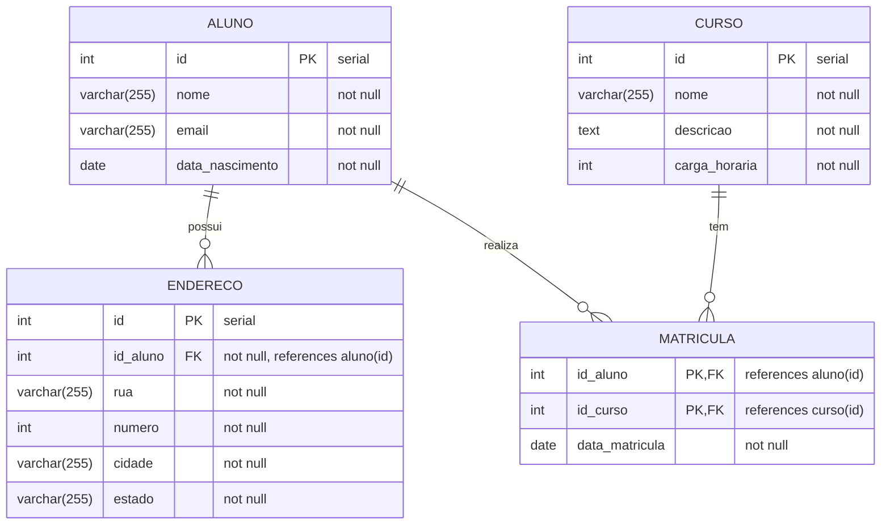

# Manipulação de dados com Node.js, Knex.js e PostgreSQL

Material didático para quem está começando a ligar uma aplicação **Node.js** a um banco **PostgreSQL**. O foco é entender **conexão**, **modelos** que encapsulam o acesso aos dados e operações **CRUD** (Create, Read, Update, Delete) usando o **Knex.js** como *query builder* — ou seja, montar consultas em JavaScript com métodos encadeados, sem escrever SQL na mão em todo o código.

## Pré-requisitos

- [Node.js](https://nodejs.org/) (versão com suporte a `node --env-file`, usada no script `npm run start`)
- [PostgreSQL](https://www.postgresql.org/) instalado e em execução
- Noções básicas de JavaScript (`async`/`await`, módulos `require`/`exports`)

## O que é o Knex.js?

[Knex.js](https://knexjs.org/) é um *query builder* para Node.js: você descreve consultas com uma API em JavaScript (`.select()`, `.where()`, `.insert()`, etc.). O Knex gera SQL parametrizado para o banco configurado, o que ajuda na **organização do código** e reduz risco de **SQL injection** quando os valores vêm de variáveis (use sempre os métodos do builder em vez de concatenar strings SQL com dados do usuário).

**Resumo do que o Knex oferece:**

- Sintaxe encadeada e legível para consultas
- Suporte a vários bancos (PostgreSQL, MySQL, SQLite, entre outros)
- Migrações e seeds (evolução controlada do esquema — não usados neste projeto mínimo, mas importantes em projetos reais)
- *Pool* de conexões configurável (`min` / `max` em `src/db/index.js`)

## Modelo de dados (escola)

O exemplo modela uma escola com relacionamentos típicos:


| Tabela        | Papel                                                      |
| ------------- | ---------------------------------------------------------- |
| **aluno**     | Cadastro de alunos                                         |
| **endereco**  | Endereços por aluno (**1:N** — um aluno, vários endereços) |
| **curso**     | Cursos ofertados                                           |
| **matricula** | Associação aluno ↔ curso (**N:N**), com data da matrícula  |


A tabela `matricula` usa **chave primária composta** (`id_aluno`, `id_curso`): um par aluno/curso não se repete.


```mermaid
erDiagram
    ALUNO ||--o{ ENDERECO : possui
    ALUNO ||--o{ MATRICULA : realiza
    CURSO ||--o{ MATRICULA : tem

    ALUNO {
        int id PK "serial"
        varchar(255) nome "not null"
        varchar(255) email "not null"
        date data_nascimento "not null"
    }

    ENDERECO {
        int id PK "serial"
        int id_aluno FK "not null, references aluno(id)"
        varchar(255) rua "not null"
        int numero "not null"
        varchar(255) cidade "not null"
        varchar(255) estado "not null"
    }

    CURSO {
        int id PK "serial"
        varchar(255) nome "not null"
        text descricao "not null"
        int carga_horaria "not null"
    }

    MATRICULA {
        int id_aluno PK,FK "references aluno(id)"
        int id_curso PK,FK "references curso(id)"
        date data_matricula "not null"
    }
```

## Como executar o projeto

1. Clone o repositório (ou use esta pasta dentro do monorepositório).
2. Instale as dependências: `npm install`
3. Crie um banco chamado `escola` no PostgreSQL.
4. Edite `.env` com `DB_HOST`, `DB_PORT`, `DB_USER`, `DB_PASSWORD` e `DB_NAME` (por exemplo `escola`).
5. Crie as tabelas executando o script [db/script.sql](./db/script.sql) no banco `escola` (via `pgAdmin`, cliente gráfico ou extensão da IDE).
6. Rode a aplicação de demonstração:

   ```bash
   npm run start
   ```

   Equivale a: `node --env-file=.env src/index.js` — o Node carrega `.env` antes de executar `src/index.js`.

O arquivo `src/index.js` cria registros de teste, lista dados, atualiza um aluno, remove o aluno e, no `finally`, chama **`await db.destroy()`** para encerrar o *pool* de conexões. Em scripts únicos isso evita deixar o processo pendurado; em um servidor HTTP o encerramento costuma ocorrer no *shutdown* da aplicação.

## Estrutura de pastas

```
projeto/
├── .env                 # Credenciais e parâmetros do banco (não versionar segredos)
├── .env.example         # Modelo de variáveis para outros desenvolvedores
├── assets/              # Imagens usadas nos slides (Marp)
├── db/
│   └── script.sql       # DDL: criação das tabelas
├── src/
│   ├── db/
│   │   └── index.js     # Instância do Knex (configuração + export)
│   ├── model/           # CRUD por entidade
│   │   ├── index.js
│   │   ├── aluno.js
│   │   ├── endereco.js
│   │   ├── curso.js
│   │   └── matricula.js
│   └── index.js         # Demonstração das operações
├── 04-manipulacao-de-dados.md
├── package.json
└── README.md
```

## Conexão com o banco (`src/db/index.js`)

Um único módulo cria a instância do Knex e a exporta para os modelos:

```javascript
const knex = require('knex');

const config = {
  client: 'pg',
  connection: {
    host: process.env.DB_HOST,
    port: process.env.DB_PORT,
    user: process.env.DB_USER,
    password: process.env.DB_PASSWORD,
    database: process.env.DB_NAME,
  },
  pool: {
    min: 2,
    max: 10,
  },
};

const db = knex(config);

module.exports = db;
```

As variáveis vêm de `.env` quando você usa `npm run start` ou `node --env-file=.env`.

## Modelos e CRUD

Cada arquivo em `src/model/` concentra as operações de uma tabela. Padrão comum:

- **Create** — `insert(...).returning(...)`
- **Read** — `select`, `where`, `first`, *joins* quando necessário
- **Update** — `where(...).update(...).returning(...)`
- **Delete** — `where(...).del()`

No PostgreSQL, `.returning('*')` (ou colunas específicas) devolve a linha afetada na mesma chamada — útil logo após `insert` ou `update`.

### Exemplo (trecho de `aluno.js`)

```javascript
const db = require('../db');

async function findAll() {
  return db('aluno').select('*');
}

async function findById(id) {
  return db('aluno').where('id', id).first();
}

async function findWithEnderecos(id) {
  const aluno = await findById(id);
  if (!aluno) return null;
  const enderecos = await db('endereco').where('id_aluno', id);
  return { ...aluno, enderecos };
}

async function create(aluno) {
  const alunos = await db('aluno').insert(aluno).returning('*');
  return alunos[0];
}

async function update(id, aluno) {
  const alunos = await db('aluno').where({ id }).update(aluno).returning('*');
  return alunos[0];
}

async function remove(id) {
  return db('aluno').where({ id }).del();
}

module.exports = {
  findAll,
  findById,
  findWithEnderecos,
  create,
  update,
  remove,
};
```

O projeto também mostra **dados relacionados** de duas formas: duas consultas (`findWithEnderecos` em `aluno.js`) ou uma consulta com `join` (`findWithAlunos` em `curso.js`).

### Filtro com mais de um critério (`AND`)

Para combinar colunas no mesmo `WHERE` (equivalente a `rua = ? AND numero = ?`), passe um objeto em `.where({ ... })` ou encadeie `.where(...)` mais de uma vez. O modelo `Endereco` expõe `findByRuaAndNumero(rua, numero)` em `src/model/endereco.js`:

```javascript
async function findByRuaAndNumero(rua, numero) {
  return db('endereco').where({ rua, numero }).select('*');
}
```

O script `src/index.js` chama essa função após criar o endereço de exemplo (`'Rua das Palmeiras'`, `1000`). A lista retornada pode ter mais de uma linha se existirem vários registros com a mesma rua e número em contextos diferentes (por exemplo, outro aluno); em geral você refina com mais colunas (`id_aluno`, `cidade`, etc.) se precisar de unicidade.

## Consultas Knex × SQL mental


| Ideia                        | Knex (exemplo)                                             |
| ---------------------------- | ---------------------------------------------------------- |
| `SELECT * FROM aluno`        | `db('aluno').select('*')`                                  |
| Filtrar por id               | `db('aluno').where('id', id).first()`                      |
| Filtrar por **rua e número** | `db('endereco').where({ rua, numero }).select('*')`        |
| Inserir                      | `db('aluno').insert({ ... }).returning('*')`               |
| Atualizar                    | `db('aluno').where({ id }).update({ ... }).returning('*')` |
| Apagar                       | `db('aluno').where({ id }).del()`                          |
| Junção                       | `.join('matricula', 'aluno.id', 'matricula.id_aluno')`     |


## Boas práticas (resumo)

1. **Um lugar para a configuração do Knex** — evita duplicar credenciais.
2. **Modelos por entidade** — facilita testar e evoluir o código.
3. **`try` / `catch` / `finally`** em rotas ou scripts que falam com o banco; em servidores HTTP, encerre o pool no desligamento do processo (por exemplo, sinais `SIGINT` / `SIGTERM`), não a cada requisição.
4. **Validar dados de entrada** antes de persistir (o exemplo é mínimo; em produção use validação explícita).
5. **Respeitar integridade referencial** — ordem de exclusão e *foreign keys* (ex.: matrículas/endereços ligados a um aluno).

## Problemas comuns


| Sintoma                   | O que verificar                                                          |
| ------------------------- | ------------------------------------------------------------------------ |
| `ECONNREFUSED`            | PostgreSQL ligado? `DB_HOST` e `DB_PORT` corretos?                       |
| autenticação falhou       | `DB_USER` / `DB_PASSWORD` no `.env`                                      |
| relação/tabela não existe | Script `db/script.sql` executado no banco certo (`DB_NAME`)              |
| processo não encerra      | Chamar `await db.destroy()` ao final de scripts (como em `src/index.js`) |


## Exercícios de implementação

Use o projeto atual (Knex + modelos em `src/model/`) como base. O foco é **expor os dados via HTTP** com **[Express](https://expressjs.com/)**, reutilizando os modelos em vez de duplicar SQL nas rotas.

### Objetivo geral

Ao final, você deve ter uma **API REST** funcional (JSON), com **listagens que aceitam filtros opcionais** na *query string*, além das operações de leitura por id e de escrita (criar / atualizar / apagar) onde indicado. A partir do **exercício 4**, inclua **`GET /cursos/:id/alunos`** e o **CRUD de matrícula** na documentação e no código.

### Exercício 1 — Projeto Express e servidor HTTP

**Objetivo:** adicionar o Express, responder JSON e centralizar erros de forma simples.

**Tarefas:**

1. Instalar dependências: `express` e, se desejar reinício automático, `nodemon` como *devDependency*.
2. Criar um módulo que configure o `app` do Express (`express()`, `express.json()`).
3. Rota de saúde: **`GET /health`** → corpo JSON `{ "ok": true }` (ou similar) com status **200**.

### Exercício 2 — Alunos: CRUD + filtros na *query string*

**Objetivo:** expor o modelo `Aluno` com REST e permitir **filtrar listagens** sem path novo para cada combinação.

**Contrato sugerido (você pode alinhar nomes com o professor):**

| Método | Caminho | Comportamento |
|--------|---------|----------------|
| `GET` | `/alunos` | Lista alunos. Filtros **opcionais** via *query string* (todos AND): |
| | | `nome` — substring no nome (use `whereILike` no PostgreSQL, ex.: `%valor%`). |
| | | `email` — substring no e-mail (`whereILike`). |
| | | `limit` e `offset` — paginação numérica (valide: inteiros ≥ 0; limite máximo, ex. 100). |
| | | `orderBy` — opcional: `nome` ou `id` (whitelist; padrão `id`). |
| `GET` | `/alunos/:id` | Um aluno por **id**; **404** se não existir. |
| `POST` | `/alunos` | Cria aluno; corpo JSON com `nome`, `email`, `data_nascimento`; **201** + corpo com o registro criado (use o modelo `Aluno.create`). |
| `PUT` | `/alunos/:id` | Atualiza; **404** se não existir; **200** com registro atualizado. |
| `DELETE` | `/alunos/:id` | Remove; **404** se não existir; **204** sem corpo ou **200** com mensagem — escolha uma convenção e documente. |

**Implementação:**

- Nas rotas, chame apenas as funções de `src/model/aluno.js` (e, se precisar, estenda o modelo com funções como `findAll({ nome, email, limit, offset, orderBy })` para manter a rota fina).
- Leia filtros com **`req.query`** (`req.query.nome`, etc.). Converta `limit`/`offset` para número com cuidado (`NaN` → ignore ou **400**).

**Critérios de conclusão:**

- Exemplo real funciona:  
  `GET /alunos?nome=gomide&limit=10&offset=0`  
  retorna só alunos cujo nome contém a substring (case insensitive no Postgres com `whereILike`).
- `GET /alunos/:id` distingue **404** de **200**.
- `POST` / `PUT` persistem via modelos e retornam JSON coerente.

### Exercício 3 — Endereços: rotas e filtros

**Objetivo:** relacionar HTTP ao modelo `Endereco`, incluindo **mais de um parâmetro** de filtro.

**Atenção (Express):** declare a rota **`GET /enderecos/por-rua-numero`** *antes* de **`GET /enderecos/:id`**. Caso contrário, o Express pode tratar `por-rua-numero` como valor de `:id`.

**Contrato sugerido:**

| Método | Caminho | Comportamento |
|--------|---------|----------------|
| `GET` | `/enderecos` | Lista endereços. Filtros opcionais (AND): `id_aluno` (exato), `rua` (substring com `whereILike`), `numero` (igualdade numérica), `cidade`, `estado`. |
| `GET` | `/enderecos/por-rua-numero?rua=...&numero=...` | **Obrigatório** informar **ambos** `rua` e `numero`; caso contrário **400** com JSON explicando. Usa a mesma ideia de `findByRuaAndNumero` (ou reutilize a função do modelo). |
| `GET` | `/enderecos/:id` | Um endereço por id; **404** se não existir. |
| `POST` | `/enderecos` | Cria endereço (corpo com `id_aluno`, `rua`, `numero`, `cidade`, `estado`). **400** se faltar campo obrigatório. |

**Critérios de conclusão:**

- `GET /enderecos/por-rua-numero?rua=Rua%20das%20Palmeiras&numero=1000` retorna os registros esperados.
- Chamada sem `rua` ou sem `numero` → **400**, não **500**.
- Filtros em `GET /enderecos` combinam com **AND** (ex.: `?id_aluno=1&estado=MG`).

### Exercício 4 — Curso: alunos matriculados e CRUD de matrícula

**Objetivo:** expor **alunos de um curso** por rota aninhada e implementar o **CRUD completo** de **matrícula** (tabela associativa `matricula`, chave composta `id_aluno` + `id_curso`), reutilizando `src/model/curso.js` e `src/model/matricula.js`.

#### Parte A — Alunos do curso

| Método | Caminho | Comportamento |
|--------|---------|----------------|
| `GET` | `/cursos/:id/alunos` | Retorna os **alunos matriculados** no curso cujo `id` está na URL. Sugestão de corpo: objeto com dados do curso (pelo menos `id` e `nome`) e array **`alunos`** com as linhas já enriquecidas (ex.: `nome`, `email`, `data_matricula` — alinhado a `Curso.findWithAlunos` / `Matricula.findByCurso`). |
| | | **404** se o curso **não existir**. |
| | | **200** com lista vazia em `alunos` (ou equivalente) se o curso existir mas não houver matrículas. |

**Implementação:** prefira **`Curso.findWithAlunos(id)`** (já agrega curso + alunos com `data_matricula`) em vez de duplicar o `join` na rota.

#### Parte B — CRUD de matrícula

Chave de negócio: par **`(id_aluno, id_curso)`**. Nos paths abaixo, ambos os segmentos são **obrigatórios** e devem ser inteiros válidos; caso contrário responda **400** com JSON claro.

| Método | Caminho | Comportamento |
|--------|---------|----------------|
| `GET` | `/matriculas` | Lista **todas** as matrículas (pode reutilizar `Matricula.findAll()` — já traz `nome_aluno` e `nome_curso`). |
| `GET` | `/matriculas/:idAluno/:idCurso` | Uma matrícula pela chave composta; **404** se não existir. Pode usar `Matricula.findById` ou `findWithDetails`. |
| `POST` | `/matriculas` | Corpo JSON: `id_aluno`, `id_curso`, `data_matricula` (formato data aceito pelo PostgreSQL, ex. `YYYY-MM-DD`). **201** + corpo com a matrícula criada. **400** se faltar campo ou tipos inválidos. **404** (ou **409**) se aluno ou curso não existir — escolha a convenção e **documente**. |
| `PUT` | `/matriculas/:idAluno/:idCurso` | Atualiza apenas **`data_matricula`** (como em `Matricula.update`). Corpo JSON: `{ "data_matricula": "..." }`. **404** se a matrícula não existir. |
| `DELETE` | `/matriculas/:idAluno/:idCurso` | Remove a linha na tabela `matricula`. **404** se não existir; **204** sem corpo (ou **200** com confirmação — documente). |

**Atenção (Express):** se existir rota `GET /matriculas/...` com prefixo estático (ex.: documentação em `/matriculas/ajuda`), defina-a **antes** de `GET /matriculas/:idAluno/:idCurso`. Do contrário, o primeiro segmento pode ser interpretado como `idAluno`.

## Referências

- [Documentação do Knex.js](https://knexjs.org/)
- [PostgreSQL — documentação](https://www.postgresql.org/docs/)