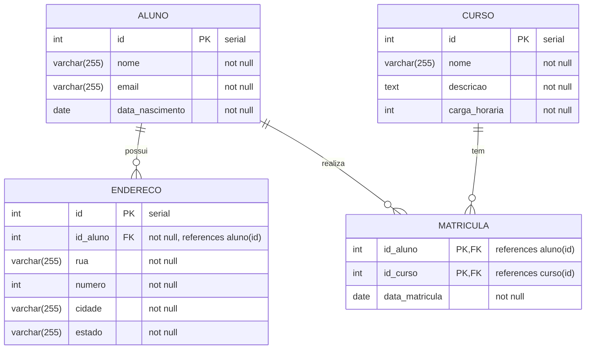

# Projeto de Manipulação de Dados com Node.js e Knex

Este projeto demonstra como criar uma aplicação para manipulação de dados em um banco de dados PostgreSQL utilizando Node.js e Knex.js. É um material didático para iniciantes em programação que desejam aprender sobre conexão com banco de dados e operações CRUD (Create, Read, Update, Delete).

## O que é o Knex.js?

[Knex.js](http://knexjs.org/) é um query builder (construtor de consultas) para Node.js. Ele permite escrever consultas SQL de forma programática, usando JavaScript, sem precisar escrever SQL diretamente. Algumas vantagens do Knex:

- **Sintaxe intuitiva**: Escreva consultas usando métodos encadeados (chainable methods)
- **Suporte a múltiplos bancos**: MySQL, PostgreSQL, SQLite, Oracle, etc.
- **Migrações**: Ferramentas para controle de versão do banco de dados
- **Segurança**: Proteção contra ataques de SQL Injection

## Estrutura do Banco de Dados

Este projeto utiliza um modelo de dados de uma escola, com as seguintes tabelas:

- **aluno**: Armazena informações dos alunos
- **endereco**: Guarda os endereços dos alunos (relacionamento 1:N com aluno)
- **curso**: Contém os cursos oferecidos pela escola
- **matricula**: Tabela de relacionamento entre alunos e cursos (N:N)



## Como Executar o Projeto

1. Clone o repositório
2. Instale as dependências: `npm install`
3. Configure o arquivo [.env](./.env) com as credenciais do banco de dados
4. Crie um banco de dados com o nome `escola`
5. Execute o script [script.sql](./db/script.sql) para criar as tabelas
6. Execute o projeto: `npm run start` ou `node --env-file=.env src/index.js`

## Estrutura do Projeto

```
projeto/
├── .env                 # Arquivo com variáveis de ambiente
├── db/
│   └── script.sql       # Script SQL para criação das tabelas
├── src/
│   ├── db/
│   │   └── index.js     # Inicialização da conexão com o banco
│   ├── model/           # Módulos para manipulação de dados
│   │   ├── index.js     # Exporta todos os modelos
│   │   ├── aluno.js     # Operações CRUD para alunos
│   │   ├── endereco.js  # Operações CRUD para endereços
│   │   ├── curso.js     # Operações CRUD para cursos
│   │   └── matricula.js # Operações CRUD para matrículas
│   └── index.js         # Ponto de entrada da aplicação
└── package.json         # Dependências e scripts do projeto
```

## Configuração do Banco de Dados

O arquivo `src/db/index.js` contém a configuração de conexão com o banco de dados:

```javascript
const knex = require('knex');

const config = {
  client: 'pg',  // Usando PostgreSQL
  connection: {
    host: process.env.DB_HOST,
    port: process.env.DB_PORT,
    user: process.env.DB_USER,
    password: process.env.DB_PASSWORD,
    database: process.env.DB_NAME,
  },
  pool: {
    min: 2,
    max: 10
  },
};

// Inicializa a conexão com o banco de dados
const db = knex(config);

module.exports = db;
```

As variáveis de ambiente são carregadas do arquivo [.env](./.env) quando executamos o projeto com `node --env-file=.env src/index.js` ou `npm run start`.

## Inicialização da Conexão

O arquivo `src/db/index.js` não apenas configura, mas também inicializa a conexão com o banco de dados e a exporta para ser usada pelos modelos:

```javascript
const knex = require('knex');
const config = { /* configuração */ };

// Inicializa a conexão
const db = knex(config);

module.exports = db;
```

## Modelos de Dados

Os modelos são responsáveis por encapsular a lógica de acesso ao banco de dados. Cada modelo implementa operações CRUD:

- **C**reate: Criar novos registros
- **R**ead: Buscar/ler registros existentes
- **U**pdate: Atualizar registros existentes
- **D**elete: Excluir registros

### Exemplo: Modelo de Aluno

```javascript
const db = require('../db');

// Buscar todos os alunos
async function findAll() {
  return db('aluno').select('*');
}

// Buscar aluno por ID
async function findById(id) {
  return db('aluno').where('id', id).first();
}

// Criar novo aluno
async function create(aluno) {
  const alunos = await db('aluno').insert(aluno).returning('*');
  return alunos[0];
}

// Atualizar aluno
async function update(id, aluno) {
  const alunos = await db('aluno').where({ id }).update(aluno).returning('*');
  return alunos[0];
}

// Excluir aluno
async function remove(id) {
  return db('aluno').where({ id }).del();
}

module.exports = {
  findAll,
  findById,
  create,
  update,
  remove
};
```

## Consultas Básicas com Knex

### Selecionar todos os registros

```javascript
// SELECT * FROM aluno
db('aluno').select('*')
```

### Filtrar registros

```javascript
// SELECT * FROM aluno WHERE id = 1
db('aluno').where('id', 1)
```

### Inserir registros

```javascript
// INSERT INTO aluno (nome, email, data_nascimento) VALUES ('João', 'joao@email.com', '1995-05-15') RETURNING *
db('aluno').insert({
  nome: 'João',
  email: 'joao@email.com',
  data_nascimento: '1995-05-15'
}).returning('*')
```

### Atualizar registros

```javascript
// UPDATE aluno SET nome = 'João Silva' WHERE id = 1 RETURNING *
db('aluno').where('id', 1).update({ nome: 'João Silva' }).returning('*')
```

### Excluir registros

```javascript
// DELETE FROM aluno WHERE id = 1
db('aluno').where('id', 1).del()
```

## Consultas com Relacionamentos

### Join simples

```javascript
// Buscar alunos matriculados em um curso
db('aluno')
  .select('aluno.*', 'matricula.data_matricula')
  .join('matricula', 'aluno.id', 'matricula.id_aluno')
  .where('matricula.id_curso', 1)
```

### Usando múltiplos joins

```javascript
// Buscar matrículas com dados de aluno e curso
db('matricula')
  .select(
    'matricula.*',
    'aluno.nome as nome_aluno',
    'curso.nome as nome_curso'
  )
  .join('aluno', 'matricula.id_aluno', 'aluno.id')
  .join('curso', 'matricula.id_curso', 'curso.id')
```

## Trabalhando com Dados Relacionados

Para buscar dados relacionados, podemos fazer:

1. **Múltiplas consultas**: Buscar entidade principal e depois buscar relacionamentos
2. **Joins**: Buscar tudo em uma única consulta e processar os resultados

### Exemplo: Buscando aluno com seus endereços

```javascript
// Buscar aluno com seus endereços
async function findWithEnderecos(id) {
  // Primeiro busca o aluno
  const aluno = await db('aluno').where('id', id).first();
  if (!aluno) return null;
  
  // Depois busca os endereços relacionados
  const enderecos = await db('endereco').where('id_aluno', id);
  
  // Retorna o aluno com seus endereços
  return { ...aluno, enderecos };
}
```
## Boas Práticas

1. **Separação de responsabilidades**: Cada modelo cuida apenas da sua entidade
2. **Abstração do acesso a dados**: Os detalhes de como os dados são armazenados ficam encapsulados nos modelos
3. **Controle de conexão**: Abrir a conexão no início e fechá-la no final do programa
4. **Tratamento de erros**: Sempre use try/catch ao trabalhar com operações assíncronas
5. **Retornar dados completos**: Após criar ou atualizar, retorne o registro completo

## Desafios para Praticar

1. Adicione validação de dados antes de inserir ou atualizar registros
2. Implemente paginação nas consultas que retornam muitos registros
3. Adicione ordenação nos resultados (ex: ordenar alunos por nome)
4. Implemente busca por texto (ex: buscar alunos por parte do nome ou email)
5. Crie uma API REST para expor as operações CRUD

## Recursos Adicionais

- [Documentação do Knex.js](http://knexjs.org/)
- [PostgreSQL](https://www.postgresql.org/)