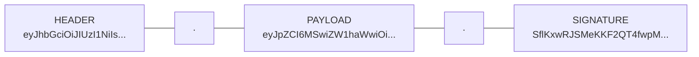
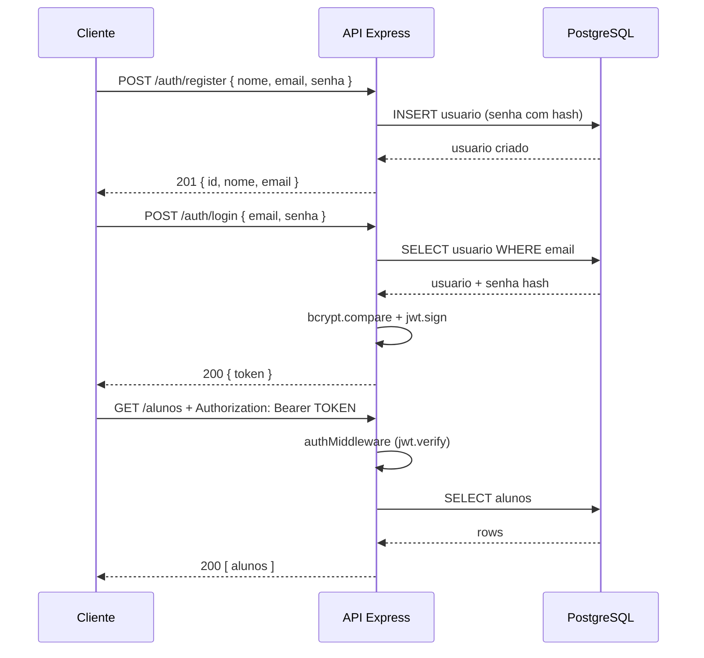
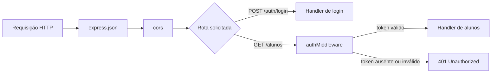

# Tokenização com JWT: JSON Web Tokens

Material didático sobre **autenticação stateless** em APIs Node.js com **Express**, **PostgreSQL** e **JSON Web Tokens (JWT)**. O projeto de exemplo protege rotas que antes eram públicas no módulo de Express: só quem fez login e recebeu um token consegue listar alunos.

## Sumário

- [Pré-requisitos](#pré-requisitos)
- [O problema que o JWT resolve](#o-problema-que-o-jwt-resolve)
- [O que é um JWT?](#o-que-é-um-jwt)
- [Anatomia de um token](#anatomia-de-um-token)
- [Fluxo de autenticação](#fluxo-de-autenticação)
- [Como executar o projeto](#como-executar-o-projeto)
- [Estrutura de pastas](#estrutura-de-pastas)
- [Explicação do projeto de exemplo](#explicação-do-projeto-de-exemplo)
- [Testando com RapidAPI Client ou curl](#testando-com-rapidapi-client-ou-curl)
- [Boas práticas e cuidados de segurança](#boas-práticas-e-cuidados-de-segurança)
- [Exercícios](#exercícios)
- [Referências](#referências)

## Pré-requisitos

- [Node.js](https://nodejs.org/) (versão com suporte a `node --env-file`)
- [PostgreSQL](https://www.postgresql.org/) em execução
- Noções de [Express.js](../05-express-configuracao-estrutura-projetos/) e conexão com banco via [`pg`](../03-conexao-com-banco-de-dados/)
- Familiaridade com `async`/`await` (middleware no Express é introduzido neste módulo)

## O problema que o JWT resolve

Imagine um prédio com catraca: a cada andar você precisaria mostrar o documento de novo se não tivesse um **crachá**. Em APIs web, o equivalente ao crachá é provar **quem você é** a cada requisição — sem guardar sessão no servidor para cada usuário conectado.

Duas abordagens comuns:

| Abordagem | Como funciona | Prós | Contras |
|-----------|---------------|------|---------|
| **Sessão no servidor** | O servidor guarda quem está logado (memória, Redis, banco) | Revogação imediata | Mais estado no servidor; escalar exige compartilhar sessões |
| **JWT (stateless)** | O servidor emite um token assinado; o cliente envia o token a cada requisição | Simples de escalar; funciona bem em APIs e SPAs | Revogar antes do vencimento exige estratégia extra (lista negra, tokens curtos) |

Neste módulo usamos JWT: após o login, o cliente guarda o token e envia no cabeçalho `Authorization` nas rotas protegidas.

## O que é um JWT?

**JWT** (*JSON Web Token*) é um padrão ([RFC 7519](https://datatracker.ietf.org/doc/html/rfc7519)) para representar informações de forma compacta e **assinada**. A assinatura garante que o conteúdo não foi alterado — desde que o **segredo** (ou a chave privada, em algoritmos assimétricos) permaneça confidencial no servidor.

Analogia: o JWT é como um **ingresso de show com holograma**. O organizador (servidor) emite o ingresso; a portaria (middleware) confere se o holograma bate com o que só o organizador sabe fabricar. Se alguém riscar o nome no ingresso, a falsificação é detectada na hora.

Bibliotecas usadas neste projeto:

- [`jsonwebtoken`](https://github.com/auth0/node-jsonwebtoken) — criar e validar tokens
- [`bcryptjs`](https://github.com/dcodeIO/bcrypt.js) — armazenar senhas com hash (nunca salve senha em texto puro)

## Anatomia de um token

Um JWT válido tem **três partes** em Base64URL, separadas por ponto:



| Parte | Conteúdo típico |
|-------|-----------------|
| **Header** | Algoritmo (ex.: `HS256`) e tipo `JWT` |
| **Payload** | *Claims*: dados do usuário (`id`, `email`) e metadados como `iat` (emitido em) e `exp` (expira em) |
| **Signature** | Assinatura do header + payload com o segredo do servidor |

O **payload não é criptografado** — apenas codificado. Não coloque senha, número de cartão ou dados sensíveis no token. Coloque só o mínimo para identificar o usuário (ex.: `id` e `email`).

## Fluxo de autenticação



1. **Registro** — cria usuário; a senha é hasheada antes de ir ao banco.
2. **Login** — valida credenciais; se corretas, devolve um JWT com prazo de validade.
3. **Rotas protegidas** — o middleware lê o token, verifica assinatura e expiração; só então a rota executa.

## Como executar o projeto

1. Entre na pasta do módulo:

   ```bash
   cd 05-jwt
   ```

2. Instale as dependências:

   ```bash
   npm install
   ```

3. Crie o banco `escola` no PostgreSQL (se ainda não existir) — o mesmo usado no projeto de Express.

4. Execute os scripts SQL na ordem:

   - [sql/usuario.sql](./sql/usuario.sql) — tabela de usuários para login
   - [sql/aluno.sql](./sql/aluno.sql) — tabela de alunos (pule se já criou no módulo anterior)

5. Configure o arquivo [.env](./.env):

   | Variável | Descrição |
   |----------|-----------|
   | `DB_HOST`, `DB_PORT`, `DB_USER`, `DB_PASSWORD`, `DB_NAME` | Conexão PostgreSQL |
   | `JWT_SECRET` | Segredo longo e aleatório para assinar tokens |
   | `JWT_EXPIRES_IN` | Validade do token (ex.: `1h`, `15m`) |

   Para gerar um `JWT_SECRET` seguro pelo terminal, use o helper [scripts/generate-jwt-secret.js](./scripts/generate-jwt-secret.js):

   ```bash
   npm run generate:jwt-secret
   ```

   O script usa o módulo nativo `crypto` do Node.js e imprime uma linha pronta para colar no `.env`, por exemplo:

   ```text
   JWT_SECRET=a1b2c3d4e5f6...
   ```

   Por padrão são gerados **64 bytes** (128 caracteres hexadecimais). Para outro tamanho, passe o valor em bytes após `--` (mínimo 32):

   ```bash
   npm run generate:jwt-secret -- 48
   ```

6. Inicie o servidor:

   ```bash
   npm run dev
   ```

   O servidor sobe na porta **3000** (ou na definida em `PORT`).

## Estrutura de pastas

```
05-jwt/
├── .env
├── scripts/
│   └── generate-jwt-secret.js  # Gera JWT_SECRET aleatório para o .env
├── sql/
│   ├── usuario.sql          # DDL da tabela usuario
│   └── aluno.sql            # DDL + seeds de aluno (opcional se já existir)
├── src/
│   ├── db/
│   │   └── index.js         # Pool do pg
│   ├── middleware/
│   │   └── auth.js          # Valida JWT e preenche req.usuario
│   ├── model/
│   │   ├── usuario.js       # Registro e busca de usuários
│   │   └── aluno.js         # Leitura de alunos (rotas protegidas)
│   └── index.js             # Rotas de auth + alunos
├── package.json
└── README.md
```

## Explicação do projeto de exemplo

### O que é middleware no Express?

Até aqui, cada rota no Express era uma função `(req, res) => { ... }` que recebia a requisição e devolvia a resposta. Para **interceptar** requisições antes delas chegarem ao handler — validar login, parsear JSON, registrar logs — o Express usa **middleware**.

Middleware é uma função com três parâmetros:

```javascript
function exemploMiddleware(req, res, next) {
  // req  — dados da requisição (headers, body, params...)
  // res  — objeto para montar a resposta
  // next — função que passa o controle adiante

  next(); // sem chamar next(), a requisição fica "presa" aqui
}
```

Analogia: pense numa fila de **checkpoints** antes do guichê. Cada checkpoint inspeciona quem passa (`req`). Se algo estiver errado, manda a pessoa embora (`res.status(401).json(...)`). Se estiver tudo certo, chama `next()` e a pessoa segue para o próximo checkpoint ou para o guichê final (o handler da rota).

Há duas formas comuns de registrar middleware:

| Forma | Sintaxe | Quando roda |
|-------|---------|-------------|
| **Global** | `app.use(middleware)` | Em **toda** requisição, na ordem em que foi registrado |
| **Por rota** | `app.get('/caminho', middleware, handler)` | Só naquela rota, **antes** do handler |

No módulo de [Express](../05-express-configuracao-estrutura-projetos/) você já usou middleware global — mesmo sem esse nome na época:

```javascript
app.use(express.json()); // converte o body JSON em req.body
app.use(cors());         // adiciona cabeçalhos de CORS na resposta
```

Neste projeto, o passo extra é um middleware **por rota** que verifica o JWT antes de liberar o acesso a `/alunos` e `/auth/me`:



Repare: middleware global sempre roda primeiro; só depois o Express decide qual rota (e quais middlewares da rota) executar.

### Registro com senha hasheada (`src/model/usuario.js`)

A senha nunca é persistida em texto puro. O `bcrypt.hash` gera um hash com *salt* embutido; na comparação do login usamos `bcrypt.compare`:

```javascript
const senhaHash = await bcrypt.hash(senha, SALT_ROUNDS);

const result = await query(
  'INSERT INTO usuario (nome, email, senha) VALUES ($1, $2, $3) RETURNING id, nome, email, created_at',
  [nome, email, senhaHash]
);
```

O `RETURNING` devolve o usuário **sem** o campo `senha` na resposta da API de registro.

### Login e emissão do token (`src/index.js`)

Após validar email e senha, o servidor assina um payload mínimo:

```javascript
const token = jwt.sign(
  { id: usuario.id, nome: usuario.nome, email: usuario.email },
  process.env.JWT_SECRET,
  { expiresIn: process.env.JWT_EXPIRES_IN || '1h' }
);

return res.json({ token });
```

O cliente deve guardar esse `token` (memória, `localStorage` em front-end, variável de ambiente em scripts — cada contexto tem trade-offs de segurança).

### Middleware de autenticação (`src/middleware/auth.js`)

Com o conceito de middleware em mente, veja como a **portaria** do JWT funciona. O cliente envia o token no cabeçalho `Authorization`, no padrão **Bearer** (o mais usado em APIs REST):

```javascript
const authMiddleware = (req, res, next) => {
  const authHeader = req.headers.authorization;

  if (!authHeader || !authHeader.startsWith('Bearer ')) {
    return res.status(401).json({ erro: 'Token não informado' });
  }

  const token = authHeader.split(' ')[1];

  try {
    const payload = jwt.verify(token, process.env.JWT_SECRET);
    req.usuario = payload; // disponível no handler da rota
    next();                // token OK — segue para o próximo passo
  } catch (error) {
    return res.status(401).json({ erro: 'Token inválido ou expirado' });
  }
};
```

Três detalhes importantes:

1. **`return res.status(...)`** — encerra aqui; **não** chama `next()`, então o handler da rota nunca roda.
2. **`req.usuario = payload`** — middlewares podem **enriquecer** `req` com dados úteis para as rotas seguintes.
3. **`next()`** — só é chamado quando o token é válido; aí o Express executa o handler (`async (req, res) => { ... }`).

Se o token estiver ausente, malformado, assinado com segredo errado ou **expirado**, a resposta é **401 Unauthorized**.

### Protegendo rotas

Para exigir login, basta **inserir o middleware entre a rota e o handler** — essa é a sintaxe `app.METODO(caminho, middleware, handler)`:

```javascript
app.get('/alunos', authMiddleware, async (req, res) => {
  // req.usuario já vem preenchido pelo authMiddleware
  const alunos = await alunoModel.getAll();
  return res.json(alunos);
});
```

Rotas **sem** `authMiddleware` permanecem públicas (`POST /auth/login`, `POST /auth/register`). Você pode encadear **vários** middlewares na mesma rota, se precisar — o Express executa da esquerda para a direita antes do handler final.

### Rotas da API

| Método | Caminho | Autenticação | Descrição |
|--------|---------|--------------|-----------|
| `GET` | `/` | Não | Informações sobre a API |
| `POST` | `/auth/register` | Não | Cadastra usuário |
| `POST` | `/auth/login` | Não | Retorna JWT |
| `GET` | `/auth/me` | Sim | Dados do usuário logado |
| `GET` | `/alunos` | Sim | Lista alunos |
| `GET` | `/alunos/:id` | Sim | Busca aluno por ID |

## Testando com RapidAPI Client ou curl

Instale a extensão [RapidAPI Client](https://marketplace.visualstudio.com/items?itemName=RapidAPI.vscode-rapidapi-client) no VS Code ou Cursor (busque por **Rapid API** na aba de extensões). Com o servidor rodando (`npm run dev`), use o painel do cliente HTTP ou os comandos `curl` abaixo.

### 1. Registrar usuário

```bash
curl -X POST http://localhost:3000/auth/register \
  -H "Content-Type: application/json" \
  -d '{"nome":"Ana Dev","email":"ana@example.com","senha":"123456"}'
```

### 2. Login (copie o `token` da resposta)

```bash
curl -X POST http://localhost:3000/auth/login \
  -H "Content-Type: application/json" \
  -d '{"email":"ana@example.com","senha":"123456"}'
```

### 3. Acessar rota protegida

Substitua `SEU_TOKEN` pelo valor retornado no login:

```bash
curl http://localhost:3000/alunos \
  -H "Authorization: Bearer SEU_TOKEN"
```

Sem o cabeçalho `Authorization`, a API responde:

```json
{ "erro": "Token não informado" }
```

No **RapidAPI Client**, crie uma requisição `GET http://localhost:3000/alunos`, abra a aba **Auth**, selecione **Bearer** e cole o token retornado no login.

## Boas práticas e cuidados de segurança

1. **`JWT_SECRET` forte** — use string longa e aleatória (`npm run generate:jwt-secret`); nunca commite o `.env` real.
2. **HTTPS em produção** — o token trafega em cada requisição; sem TLS, interceptadores na rede podem capturá-lo.
3. **Expiração curta** — `JWT_EXPIRES_IN` de horas ou minutos; renove com *refresh token* em sistemas maiores (tópico avançado).
4. **Payload enxuto** — só identificadores; busque dados frescos no banco quando necessário (`GET /auth/me`).
5. **Senhas com hash** — bcrypt (ou argon2) com custo adequado; nunca logue senhas ou tokens completos.
6. **Revogação** — JWT sozinho não “desloga” no servidor até expirar; para logout imediato em produção, combine tokens curtos, refresh tokens ou blacklist.

## Exercícios

### Exercício 1 — Proteger criação de aluno

Adicione `POST /alunos` que cria um aluno no banco, **somente para usuários autenticados**. Reutilize o padrão do modelo `aluno` do projeto Express (`insert`). Retorne **201** com o aluno criado.

### Exercício 2 — Middleware opcional

Crie um middleware `authOptional` que, se houver token válido, preenche `req.usuario`; se não houver token, segue mesmo assim (`next()`). Use em `GET /` para incluir `"usuario": { ... }` na resposta quando autenticado.

### Exercício 3 — Validação de senha no registro

No `POST /auth/register`, exija senha com **mínimo 8 caracteres** e pelo menos **um número**. Retorne **400** com mensagem clara se a regra falhar.

### Exercício 4 — Refresh de perfil após alteração

Implemente `PUT /auth/me` (protegida) para atualizar `nome` do usuário logado. Após salvar no banco, **emita um novo JWT** com o nome atualizado e devolva `{ token, usuario }`.

### Exercício 5 — Tratamento de token expirado

No middleware, distinga token expirado (`TokenExpiredError`) de token inválido e retorne JSON diferente, por exemplo `{ "erro": "Token expirado", "codigo": "TOKEN_EXPIRADO" }`, para o front-end saber quando pedir login de novo.

## Referências

- [JSON Web Tokens — jwt.io](https://jwt.io/)
- [RFC 7519 — JSON Web Token](https://datatracker.ietf.org/doc/html/rfc7519)
- [jsonwebtoken (npm)](https://www.npmjs.com/package/jsonwebtoken)
- [bcryptjs (npm)](https://www.npmjs.com/package/bcryptjs)
- [Express.js](https://expressjs.com/)
- [RapidAPI Client (VS Code)](https://marketplace.visualstudio.com/items?itemName=RapidAPI.vscode-rapidapi-client)
