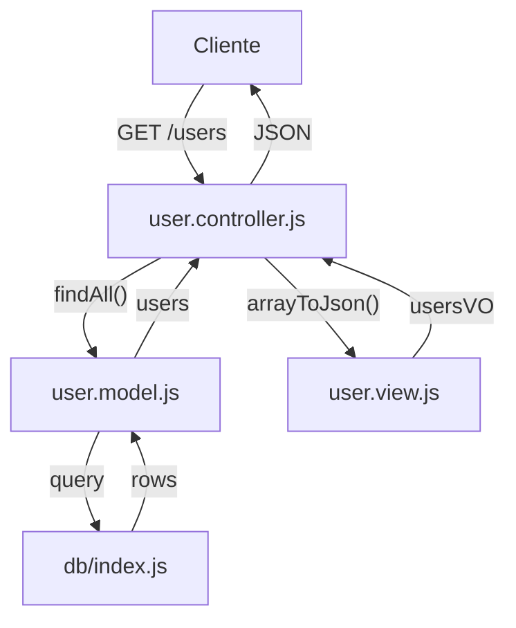

# Padrão Model-View-Controller (MVC)

## Sumário
- [Introdução](#introdução)
- [O que é o MVC?](#o-que-é-o-mvc)
- [Componentes do MVC](#componentes-do-mvc)
- [Fluxo de Dados no MVC](#fluxo-de-dados-no-mvc)
- [Benefícios do MVC](#benefícios-do-mvc)
- [Exercício](#exercício)

## Introdução
O padrão Model-View-Controller (MVC) é uma arquitetura de software que separa a lógica de negócios da interface do usuário. 

Este padrão é amplamente utilizado no desenvolvimento web e ajuda a organizar o código de forma mais estruturada e manutenível.

## O que é o MVC?

MVC é um padrão de design que divide uma aplicação em três componentes principais:

- **Model (Modelo)**: Gerencia os dados e a lógica de negócios
- **View (Visão)**: Responsável pela apresentação dos dados ao usuário
- **Controller (Controlador)**: Coordena as interações entre o Model e a View

## Componentes do MVC

### 1. Model (Modelo)
- Representa os dados e a lógica de negócios da aplicação
- Gerencia o acesso aos dados (banco de dados, arquivos, etc.)
- Contém as regras de validação e manipulação dos dados
- É independente da interface do usuário

Exemplo do projeto:

- [src/model/user.model.js](./src/model/user.model.js)

Este arquivo contém a lógica de negócios relacionada aos usuários.

### 2. View (Visão)
- Responsável pela apresentação dos dados ao usuário
- Exibe as informações do Model
- Pode ser uma página HTML, um arquivo JSON, um template, ou qualquer formato de saída
- Não contém lógica de negócios

Exemplo do projeto:

- [src/view/user.view.js](./src/view/user.view.js)

Este arquivo gerencia como os dados dos usuários são apresentados.

### 3. Controller (Controlador)

- Recebe as requisições do usuário
- Coordena as interações entre Model e View
- Processa os dados recebidos
- Decide qual View será exibida

Exemplo do projeto:

- [src/controller/user.controller.js](./src/controller/user.controller.js)

Este arquivo gerencia as requisições relacionadas aos usuários.

## Fluxo de Dados no MVC
1. O usuário faz uma requisição
2. O Controller recebe a requisição
3. O Controller solicita dados ao Model
4. O Model processa os dados e retorna ao Controller
5. O Controller envia os dados para a View
6. A View formata os dados e retorna ao Controller
7. O Controller envia os dados para o usuário



## Benefícios do MVC
1. **Separação de Responsabilidades**
   - Cada componente tem uma função específica
   - Facilita a manutenção do código
   - Permite trabalho em equipe mais eficiente

2. **Reutilização de Código**
   - Models podem ser reutilizados em diferentes Views
   - Views podem ser reutilizadas com diferentes Models

3. **Manutenibilidade**
   - Código mais organizado e fácil de entender
   - Facilita a implementação de novas funcionalidades
   - Simplifica a correção de bugs

4. **Testabilidade**
   - Componentes isolados são mais fáceis de testar
   - Permite testes unitários mais eficientes

## Exercício

Neste exercício, você irá implementar um sistema de gerenciamento de tarefas (Todo List) seguindo o padrão MVC. Você precisará criar todos os componentes necessários e integrá-los ao projeto existente.

### 1. Banco de Dados
Crie um novo arquivo `sql/todo.sql` com a seguinte estrutura:

```sql
create table todos (
  id serial primary key,
  title varchar(255) not null,
  description text,
  completed boolean default false,
  user_id integer references users(id),
  created_at timestamp default current_timestamp
);
```

### 2. Model
Crie um novo arquivo `src/model/todo.model.js` com os seguintes métodos:

```javascript
const { query } = require('../db');

const findAll = async () => {
  const todos = await query('SELECT * FROM todos ORDER BY created_at DESC');
  return todos.rows;
};

const findById = async (id) => {
  const todo = await query('SELECT * FROM todos WHERE id = $1', [id]);
  return todo.rows[0];
};

const create = async (todo) => {
  const { title, description, user_id } = todo;
  const result = await query(
    'INSERT INTO todos (title, description, user_id) VALUES ($1, $2, $3) RETURNING *',
    [title, description, user_id]
  );
  return result.rows[0];
};

const update = async (id, todo) => {
  const { title, description, completed } = todo;
  const result = await query(
    'UPDATE todos SET title = $1, description = $2, completed = $3 WHERE id = $4 RETURNING *',
    [title, description, completed, id]
  );
  return result.rows[0];
};

const remove = async (id) => {
  await query('DELETE FROM todos WHERE id = $1', [id]);
};

module.exports = {
  findAll,
  findById,
  create,
  update,
  remove
};
```

### 3. View
Crie um novo arquivo `src/view/todo.view.js` com os seguintes métodos:

```javascript
const toJson = (todo) => {
  return {
    id: todo.id,
    title: todo.title,
    description: todo.description,
    completed: todo.completed,
    user_id: todo.user_id,
    created_at: todo.created_at
  };
};

const arrayToJson = (todos) => {
  return todos.map(todo => toJson(todo));
};

module.exports = {
  toJson,
  arrayToJson
};
```

### 4. Controller
Crie um novo arquivo `src/controller/todo.controller.js` com as seguintes rotas:

```javascript
const router = require('express').Router();
const todoModel = require('../model/todo.model');
const todoView = require('../view/todo.view');

// Listar todas as tarefas
router.get('/todos', async (request, response) => {
  const todos = await todoModel.findAll();
  const todosVO = todoView.arrayToJson(todos);
  response.json(todosVO);
});

// Buscar uma tarefa específica
router.get('/todos/:id', async (request, response) => {
  const { id } = request.params;
  const todo = await todoModel.findById(id);
  
  if (!todo) {
    return response.status(404).json({ error: 'Tarefa não encontrada' });
  }
  
  const todoVO = todoView.toJson(todo);
  response.json(todoVO);
});

// Criar uma nova tarefa
router.post('/todos', async (request, response) => {
  const todo = request.body;
  const newTodo = await todoModel.create(todo);
  const todoVO = todoView.toJson(newTodo);
  response.status(201).json(todoVO);
});

// Atualizar uma tarefa
router.put('/todos/:id', async (request, response) => {
  const { id } = request.params;
  const todo = request.body;
  
  const updatedTodo = await todoModel.update(id, todo);
  if (!updatedTodo) {
    return response.status(404).json({ error: 'Tarefa não encontrada' });
  }
  
  const todoVO = todoView.toJson(updatedTodo);
  response.json(todoVO);
});

// Remover uma tarefa
router.delete('/todos/:id', async (request, response) => {
  const { id } = request.params;
  await todoModel.remove(id);
  response.status(204).send();
});

module.exports = router;
```

### 5. Integração
Atualize o arquivo `src/index.js` para incluir as novas rotas:

```javascript
const express = require('express');
const app = express();
const userController = require('./controller/user.controller');
const todoController = require('./controller/todo.controller');

app.use(express.json());

app.use("/", userController);
app.use("/", todoController);

app.listen(3000, () => {
  console.log('Servidor escutando na porta 3000');
});
```

### 6. Testando a API
Após implementar todas as partes, você poderá testar os seguintes endpoints:

1. **Listar todas as tarefas**
   - Método: GET
   - URL: `http://localhost:3000/todos`
   - Resposta: Lista de todas as tarefas

2. **Buscar uma tarefa específica**
   - Método: GET
   - URL: `http://localhost:3000/todos/:id`
   - Resposta: Detalhes da tarefa específica

3. **Criar uma nova tarefa**
   - Método: POST
   - URL: `http://localhost:3000/todos`
   - Body:
     ```json
     {
       "title": "Minha tarefa",
       "description": "Descrição da tarefa",
       "user_id": 1
     }
     ```
   - Resposta: Tarefa criada

4. **Atualizar uma tarefa**
   - Método: PUT
   - URL: `http://localhost:3000/todos/:id`
   - Body:
     ```json
     {
       "title": "Tarefa atualizada",
       "description": "Nova descrição",
       "completed": true
     }
     ```
   - Resposta: Tarefa atualizada

5. **Remover uma tarefa**
   - Método: DELETE
   - URL: `http://localhost:3000/todos/:id`
   - Resposta: Status 204 (No Content)

### 7. Desafios Adicionais
1. Implemente validação de dados nas requisições como por exemplo:
   - Verificar se o título é obrigatório
   - Verificar se o usuário existe
   - Verificar se o status é válido
2. Adicione filtros na listagem de tarefas (por status, usuário, etc.). Utilize query params para isso.