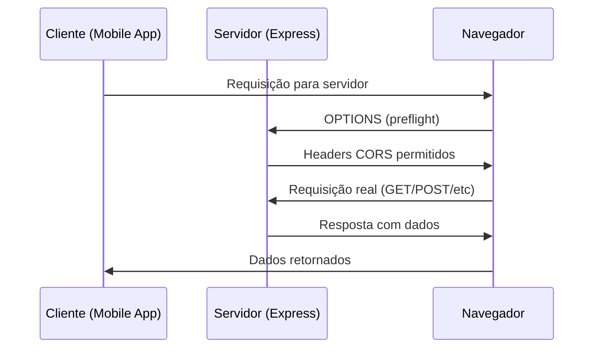

# Configuração de CORS e Integração Mobile-Server

## Sumário
- [Introdução](#introdução)
- [O que é CORS?](#o-que-é-cors)
- [Problemas resolvidos pelo CORS](#problemas-resolvidos-pelo-cors)
- [Como o CORS funciona](#como-o-cors-funciona)
- [Estrutura do Projeto de Exemplo](#estrutura-do-projeto-de-exemplo)
- [Aplicação Server](#aplicação-server)
- [Aplicação Mobile](#aplicação-mobile)
- [Integração entre as Aplicações](#integração-entre-as-aplicações)
- [Configuração do CORS](#configuração-do-cors)
- [Testando a Integração](#testando-a-integração)
- [Exercícios](#exercícios)

## Introdução

Este projeto demonstra a integração entre uma aplicação mobile (React Native/Expo) e uma aplicação server (Node.js/Express), com foco especial na configuração do CORS (Cross-Origin Resource Sharing). 

A integração entre aplicações de diferentes origens (domínios, portas ou protocolos) é um desafio comum no desenvolvimento web e mobile, e o CORS é a solução padrão para permitir essa comunicação de forma segura.

## O que é CORS?

**CORS (Cross-Origin Resource Sharing)** é um mecanismo de segurança implementado pelos navegadores web que controla como recursos de uma origem (origin) podem ser acessados por requisições de outras origens.

Uma **origem** é definida pela combinação de:
- **Protocolo** (http, https)
- **Domínio** (localhost, example.com)
- **Porta** (3000, 8080, 443)

### Exemplos de origens diferentes:
- `http://localhost:3000` vs `http://localhost:3001` (portas diferentes)
- `http://localhost:3000` vs `https://localhost:3000` (protocolos diferentes)
- `http://localhost:3000` vs `http://192.168.1.100:3000` (domínios diferentes)

## Problemas resolvidos pelo CORS

### 1. **Política de Mesma Origem (Same-Origin Policy)**
Por padrão, os navegadores bloqueiam requisições entre origens diferentes por questões de segurança. Isso impede:
- Ataques de Cross-Site Request Forgery (CSRF)
- Acesso não autorizado a recursos de outros domínios
- Vazamento de informações sensíveis

### 2. **Comunicação entre Aplicações**
O CORS permite que aplicações legítimas se comuniquem:
- APIs web sendo consumidas por aplicações mobile
- Microserviços se comunicando entre si
- Aplicações frontend consumindo APIs backend

### 3. **Desenvolvimento e Produção**
Facilita o desenvolvimento em ambientes locais onde aplicações rodam em portas diferentes.

## Como o CORS funciona

### 1. **Requisição Simples (Simple Request)**
- Métodos: GET, POST, HEAD
- Headers básicos
- Não dispara preflight

### 2. **Requisição Preflight (Preflight Request)**
- Métodos: PUT, DELETE, PATCH
- Headers customizados
- Dispara uma requisição OPTIONS antes da requisição real

### 3. **Fluxo de uma requisição CORS:**


## Estrutura do Projeto de Exemplo

O projeto está organizado em duas aplicações principais:

```
07-cors/
├── mobile-app/          # Aplicação React Native/Expo
│   ├── src/
│   │   └── screens/
│   │       └── MainScreen.js
│   ├── package.json
│   └── App.js
├── server/              # Servidor Node.js/Express
│   ├── src/
│   │   └── index.js
│   └── package.json
└── README.md
```

## Aplicação Server

### **Tecnologias utilizadas:**
- **Node.js**: Runtime JavaScript
- **Express.js**: Framework web
- **CORS**: Middleware para configuração de CORS

### **Arquivo principal:** [server/src/index.js](./server/src/index.js)

```javascript
const express = require('express');
const app = express();
const cors = require('cors');

// Middleware para permitir requisições de outros domínios
app.use(cors());
// Middleware para converter o corpo das requisições como JSON
app.use(express.json());

app.get("/ping", (req, res) => {
  res.json({ message: "pong" });
});

app.listen(3000, () => {
  console.log('Servidor escutando na porta 3000');
});
```

### **Funcionalidades:**
1. **Endpoint `/ping`**: Retorna uma resposta simples para testar a conectividade
2. **Middleware CORS**: Configurado para permitir requisições de qualquer origem
3. **Middleware JSON**: Converte requisições para formato JSON

### **Dependências principais:**
- `express`: Framework web para Node.js
- `cors`: Middleware para configuração de CORS

## Aplicação Mobile

### **Tecnologias utilizadas:**
- **React Native**: Framework para desenvolvimento mobile
- **Expo**: Plataforma para desenvolvimento React Native
- **Axios**: Cliente HTTP para fazer requisições

### **Arquivo principal:** [mobile-app/src/screens/MainScreen.js](./mobile-app/src/screens/MainScreen.js)

```javascript
import { Button, Text, View } from "react-native"
import axios from "axios"
import { useState } from "react"

const MainScreen = () => {
  const [data, setData] = useState('null')

  const getServerData = async () => {
    const response = await axios.get("http://localhost:3000/ping")
    const responseData = response.data
    const message = JSON.stringify(responseData)
    setData(message)
  }

  return (
    <View>
      <Text>Hit the button to get the data from server</Text>
      <Button title="Get Data" onPress={getServerData} />
      <Text>{data}</Text>
    </View>
  )
}

export default MainScreen
```

### **Funcionalidades:**
1. **Interface simples**: Botão para fazer requisição e exibir resposta
2. **Requisição HTTP**: Usa Axios para consumir a API do servidor
3. **Estado local**: Gerencia a resposta do servidor usando React hooks

### **Dependências principais:**
- `expo`: Plataforma para desenvolvimento React Native
- `axios`: Cliente HTTP para requisições
- `react-native`: Framework para desenvolvimento mobile

## Integração entre as Aplicações

### **Fluxo de comunicação:**

1. **Mobile App** faz uma requisição HTTP para `http://localhost:3000/ping`
2. **Servidor** recebe a requisição e processa
3. **Servidor** retorna resposta JSON: `{ "message": "pong" }`
4. **Mobile App** recebe a resposta e exibe na interface

### **Pontos de integração:**

- **URL**: `http://localhost:3000/ping`
- **Protocolo**: HTTP
- **Formato**: JSON
- **Método**: GET

## Configuração do CORS

### **Configuração básica (permitir todas as origens):**

```javascript
const cors = require('cors');
app.use(cors());
```

### **Configuração personalizada:**

```javascript
const corsOptions = {
  origin: ['http://localhost:19006', 'http://localhost:3000'],
  methods: ['GET', 'POST', 'PUT', 'DELETE'],
  allowedHeaders: ['Content-Type', 'Authorization'],
  credentials: true
};

app.use(cors(corsOptions));
```

### **Configuração por rota:**

```javascript
app.get('/api/public', cors(), (req, res) => {
  // Rota pública com CORS
});

app.get('/api/private', cors({
  origin: 'http://localhost:19006'
}), (req, res) => {
  // Rota privada com CORS restrito
});
```

### **Headers CORS importantes:**

- `Access-Control-Allow-Origin`: Define quais origens podem acessar
- `Access-Control-Allow-Methods`: Define métodos HTTP permitidos
- `Access-Control-Allow-Headers`: Define headers permitidos
- `Access-Control-Allow-Credentials`: Permite envio de cookies/credenciais

## Testando a Integração

### **1. Iniciar o servidor:**
```bash
cd server
npm install
npm run dev
```

### **2. Iniciar a aplicação mobile:**
```bash
cd mobile-app
npm install
npm start
```

### **3. Testar a comunicação:**
1. Abra o Expo Go no seu dispositivo/emulador
2. Escaneie o QR code ou conecte via USB
3. Toque no botão "Get Data"
4. Verifique se a resposta `{"message":"pong"}` é exibida

### **4. Verificar no console do servidor:**
```
Servidor escutando na porta 3000
```

## Exercícios

### **Exercício 1: Configuração de CORS Restritiva**

Modifique o servidor para permitir apenas requisições da aplicação mobile:

```javascript
const corsOptions = {
  origin: 'http://localhost:19006', // Porta padrão do Expo
  methods: ['GET', 'POST'],
  allowedHeaders: ['Content-Type']
};

app.use(cors(corsOptions));
```

### **Exercício 2: Nova Rota com Validação CORS**

Crie uma nova rota `/api/users` que retorna uma lista de usuários e configure CORS específico para ela:

```javascript
app.get('/api/users', cors({
  origin: 'http://localhost:19006',
  methods: ['GET']
}), (req, res) => {
  const users = [
    { id: 1, name: 'João Silva' },
    { id: 2, name: 'Maria Santos' }
  ];
  res.json(users);
});
```

### **Exercício 3: Middleware de Log para CORS**

Crie um middleware que registre todas as requisições CORS:

```javascript
app.use((req, res, next) => {
  console.log(`[CORS] ${req.method} ${req.url} - Origin: ${req.headers.origin}`);
  next();
});

app.use(cors());
```

### **Exercício 4: Tratamento de Erros CORS**

Implemente tratamento de erro para requisições CORS bloqueadas:

```javascript
app.use(cors({
  origin: 'http://localhost:19006',
  credentials: true
}));

app.use((err, req, res, next) => {
  if (err.message === 'Not allowed by CORS') {
    res.status(403).json({ 
      error: 'Acesso negado por política CORS',
      origin: req.headers.origin 
    });
  } else {
    next(err);
  }
});
```

### **Exercício 5: Aplicação Mobile com Múltiplas APIs**

Modifique a aplicação mobile para consumir múltiplas rotas da API:

```javascript
const [users, setUsers] = useState([]);
const [loading, setLoading] = useState(false);

const getUsers = async () => {
  setLoading(true);
  try {
    const response = await axios.get('http://localhost:3000/api/users');
    setUsers(response.data);
  } catch (error) {
    console.error('Erro ao buscar usuários:', error);
  } finally {
    setLoading(false);
  }
};
```

### **Exercício 6: Configuração de Ambiente**

Crie arquivos de configuração para diferentes ambientes:

```javascript
// config/cors.js
const corsConfig = {
  development: {
    origin: ['http://localhost:19006', 'http://localhost:3000'],
    credentials: true
  },
  production: {
    origin: 'https://seudominio.com',
    credentials: true
  }
};

module.exports = corsConfig[process.env.NODE_ENV || 'development'];
```

## Referências

- [MDN Web Docs - CORS](https://developer.mozilla.org/pt-BR/docs/Web/HTTP/CORS)
- [Express.js - CORS](https://expressjs.com/en/resources/middleware/cors.html)
- [React Native](https://reactnative.dev/)
- [Expo](https://expo.dev/)
- [Axios](https://axios-http.com/)
- [Node.js](https://nodejs.org/)